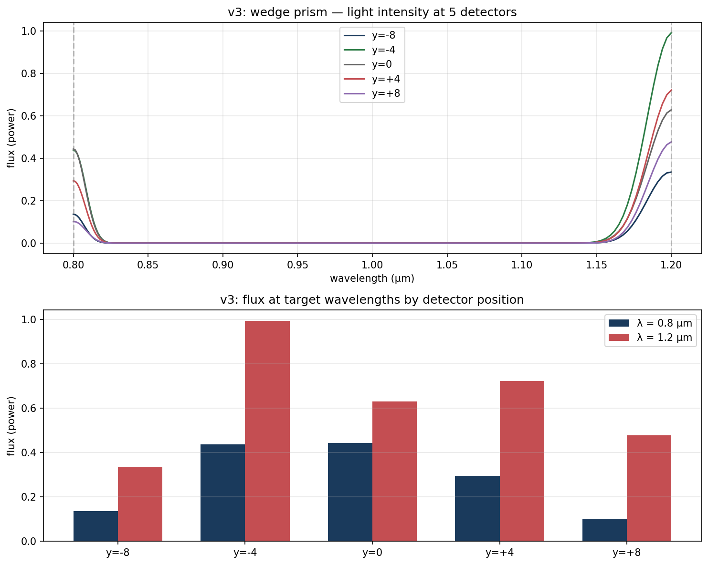

# prism-theory

**© 2026 Max Conrad. All rights reserved.**

## what is this

a research project testing whether a passive material structure (like a crystal or metamaterial) can take in a composite light signal carrying data and decompose it into meaningful components that produce a computational result — no electronics, no binary, no voltage thresholds. just light and physics.

## the hypothesis

light goes in carrying data. the structure does the math. correct answer comes out as light.

more specifically: a passive photonic structure can decompose a composite optical signal into distinct components that encode meaningful data, and the interaction of those components can produce a predictable computational result — all without electronic conversion.

## experiments

### [01 — decomposition](01_decomposition/)

can a structure separate two wavelengths of light that enter as one beam?

**status: PASS (v3)**



wedge prism with dispersive material separates 0.8μm and 1.2μm to different detectors. separation is in the ratios not clean isolation — next step is testing whether those ratios are consistent across varying inputs.

[session notes](01_decomposition/session_notes.md)

## setup

```bash
conda create -n prism python=3.10 -y
conda activate prism
conda install -c conda-forge pymeep -y
pip install matplotlib h5py numpy
```

## tool

[MEEP](https://meep.readthedocs.io/) (MIT Electromagnetic Equation Propagation) — open source FDTD simulation engine for modeling how light interacts with structures.